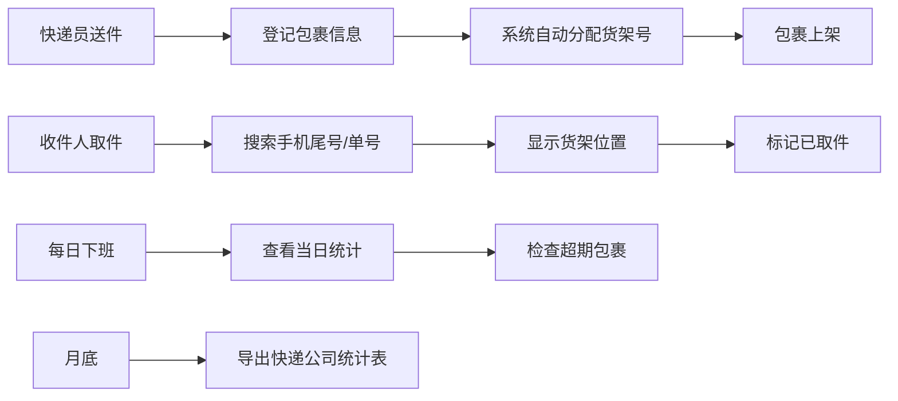

## 1. 产品概述

菜鸟驿站包裹管理系统是一款面向小型社区驿站的轻量化包裹登记与取件管理工具。通过扫描单号、自动分配货架、智能查询取件等功能，帮助驿站工作人员高效管理日常包裹收发业务。

- **核心目标**：简化包裹登记流程，提升取件效率，降低人工差错率
- **目标用户**：小型菜鸟驿站/社区代收点工作人员
- **产品价值**：零学习成本、即开即用、数据本地存储安全可靠

## 2. 核心功能

### 2.1 用户角色

| 角色 | 注册方式 | 核心权限 |
|------|----------|----------|
| 驿站管理员 | 本地使用，无需注册 | 包裹登记、取件查询、数据统计、导出报表 |

### 2.2 功能模块

1. **包裹登记页**：快递单号录入、收件人信息录入、快递公司选择、自动分配货架号
2. **取件查询页**：按手机尾号/单号搜索、包裹位置展示、一键标记取件
3. **数据统计页**：今日收件/取件/待取统计、超期包裹预警、快递公司月度统计、数据导出

### 2.3 页面详情

| 页面名称 | 模块名称 | 功能描述 |
|----------|----------|----------|
| 包裹登记页 | 快速录入表单 | 单号扫描/输入、收件人姓名、手机尾号、快递公司下拉选择 |
| 包裹登记页 | 货架自动分配 | 根据当前库存情况自动生成货架号（格式：区号+层号+位号，如A-3-02） |
| 包裹登记页 | 登记成功提示 | 显示分配的货架号，支持打印/复制货架号 |
| 取件查询页 | 搜索功能 | 支持手机尾号搜索、快递单号搜索、姓名搜索 |
| 取件查询页 | 包裹列表 | 展示匹配包裹的货架位置、快递公司、入库时间、状态 |
| 取件查询页 | 标记取件 | 一键标记包裹已取，记录取件时间 |
| 取件查询页 | 超期提醒 | 入库超过3天的包裹标红高亮显示 |
| 数据统计页 | 今日概览 | 今日收件数、今日取件数、当前待取数、超期件数 |
| 数据统计页 | 超期包裹列表 | 列出所有超期未取包裹，方便电话催收 |
| 数据统计页 | 快递公司统计 | 按月统计各快递公司入库数量排名 |
| 数据统计页 | 数据导出 | 导出月度CSV统计表 |

## 3. 核心流程

### 3.1 包裹登记流程
快递员送达包裹 → 工作人员输入单号和收件人信息 → 系统自动分配货架号 → 打印/记录货架号 → 将包裹放到对应货架

### 3.2 取件流程
收件人报手机尾号/单号 → 工作人员搜索 → 系统显示包裹货架位置 → 找到包裹 → 标记已取

### 3.3 数据统计流程
每日下班前查看当日数据 → 检查超期包裹进行催收 → 月底导出快递公司统计表

## 4. 用户界面设计

### 4.1 设计风格
- **主色调**：橙色系（#FF6B35），呼应菜鸟驿站品牌调性，温暖活力
- **辅助色**：深灰蓝（#2C3E50）作为文字和次要元素
- **警示色**：红色（#E74C3C）用于超期包裹高亮
- **成功色**：绿色（#27AE60）用于已取件状态
- **按钮风格**：圆角矩形按钮，橙色主按钮，悬停有微缩放动效
- **字体**：使用系统无衬线字体，清晰易读，数字使用等宽字体
- **布局风格**：卡片式布局，左右分栏导航，内容区简洁大气
- **图标风格**：线性图标，简洁现代，与橙色主题呼应

### 4.2 页面设计概览

| 页面名称 | 模块名称 | UI元素 |
|----------|----------|--------|
| 包裹登记页 | 录入表单 | 大号输入框、橙色提交按钮、成功动画反馈 |
| 包裹登记页 | 货架号展示 | 大字体货架号卡片，渐变背景，可复制按钮 |
| 取件查询页 | 搜索栏 | 顶部搜索框，支持多条件搜索，实时过滤 |
| 取件查询页 | 包裹卡片 | 货架号醒目展示，状态标签，取件按钮 |
| 数据统计页 | 数据卡片 | 四个统计数字卡片，渐变背景，图标+数字 |
| 数据统计页 | 超期列表 | 红色边框警示，超期天数标签 |
| 数据统计页 | 统计图表 | 柱状图展示快递公司排名 |

### 4.3 响应式
- 以桌面端为主（1024px以上），适配驿站电脑使用
- 平板端自适应，保证核心功能可用
- 触屏优化，按钮尺寸适合点击操作

### 4.4 视觉细节
- 卡片悬浮效果：hover时轻微上浮和阴影加深
- 表单聚焦：输入框聚焦时有橙色光晕效果
- 状态切换：取件标记时有平滑过渡动画
- 空状态：友好的空状态插画和提示文字
