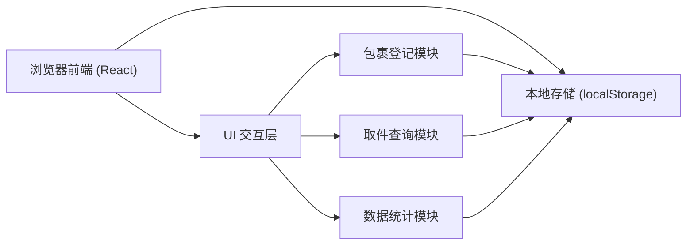
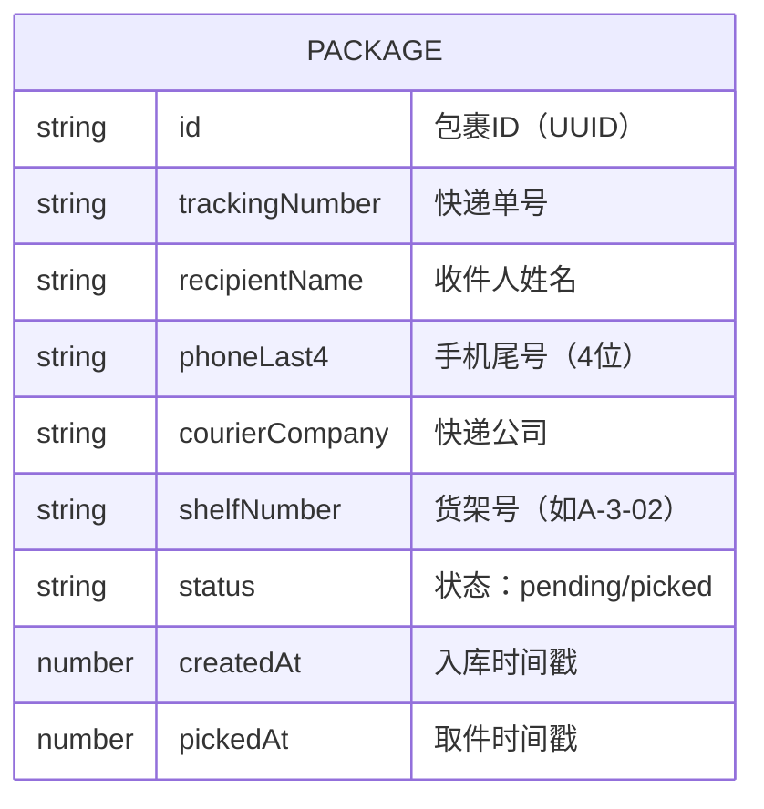

## 1. 架构设计

本系统为纯前端单页应用，数据存储在浏览器本地，无需后端服务，适合小型驿站单机使用。



## 2. 技术选型

- **前端框架**：React@18 + TypeScript
- **构建工具**：Vite@5
- **样式方案**：TailwindCSS@3
- **路由管理**：React Router DOM@6
- **图标库**：Lucide React
- **数据存储**：浏览器 localStorage（无需后端数据库）
- **图表展示**：原生 CSS 实现柱状图（轻量方案）

## 3. 目录结构

```
src/
├── components/          # 公共组件
│   ├── Layout/         # 布局组件（侧边栏导航）
│   ├── PackageCard/    # 包裹卡片组件
│   └── StatCard/       # 统计卡片组件
├── pages/              # 页面组件
│   ├── Register/       # 包裹登记页
│   ├── Pickup/         # 取件查询页
│   └── Statistics/     # 数据统计页
├── hooks/              # 自定义 Hooks
│   └── usePackages.ts  # 包裹数据管理 Hook
├── utils/              # 工具函数
│   ├── shelf.ts        # 货架号分配逻辑
│   ├── storage.ts      # 本地存储封装
│   └── export.ts       # CSV 导出工具
├── types/              # TypeScript 类型定义
│   └── index.ts
├── App.tsx
├── main.tsx
└── index.css
```

## 4. 路由定义

| 路由路径 | 页面名称 | 功能说明 |
|----------|----------|----------|
| / | 包裹登记页 | 默认首页，快速登记包裹 |
| /pickup | 取件查询页 | 搜索包裹、标记取件 |
| /statistics | 数据统计页 | 今日统计、超期预警、月度报表 |

## 5. 数据模型

### 5.1 数据结构定义



### 5.2 TypeScript 类型定义

```typescript
interface Package {
  id: string;
  trackingNumber: string;
  recipientName: string;
  phoneLast4: string;
  courierCompany: string;
  shelfNumber: string;
  status: 'pending' | 'picked';
  createdAt: number;
  pickedAt?: number;
}

interface ShelfConfig {
  zones: string[];     // 区号：['A', 'B', 'C']
  floors: number;      // 层数：3
  slotsPerFloor: number; // 每层位数：20
}

interface DailyStats {
  todayReceived: number;
  todayPicked: number;
  pendingCount: number;
  overdueCount: number;
}
```

### 5.3 本地存储键名

- `package_list` - 包裹列表数据
- `shelf_config` - 货架配置（可自定义）

## 6. 核心算法

### 6.1 货架号分配算法

- 规则：按区号 → 层号 → 位号 顺序分配
- 格式：`{区号}-{层号}-{位号（两位补零）}`
- 示例：A-1-01, A-1-02, ..., A-3-20, B-1-01
- 优先使用同一区域内的空位，均匀分配

### 6.2 超期判断逻辑

- 超期阈值：3天（72小时）
- 判断条件：`当前时间 - 入库时间 > 3 * 24 * 3600 * 1000`
- 仅对状态为 `pending` 的包裹进行超期判断

### 6.3 搜索匹配逻辑

- 手机尾号搜索：精确匹配后4位
- 快递单号搜索：模糊匹配（包含关系）
- 姓名搜索：模糊匹配（包含关系）
- 支持多关键词组合搜索

## 7. 功能模块实现要点

### 7.1 包裹登记模块
- 表单验证：单号必填、手机尾号4位数字校验
- 重复单号检测：提示已存在的单号
- 自动聚焦：登记成功后自动聚焦单号输入框，方便连续录入
- 键盘快捷键：回车快速提交

### 7.2 取件查询模块
- 实时搜索：输入即搜索，无需点击搜索按钮
- 批量取件：支持一次标记多个包裹已取
- 超期高亮：超过3天未取的包裹红色边框+红色背景

### 7.3 数据统计模块
- 今日统计：按自然日计算（0点重置）
- 超期包裹列表：按超期天数降序排列
- 快递公司统计：按月度分组统计
- CSV导出：包含所有包裹完整信息
